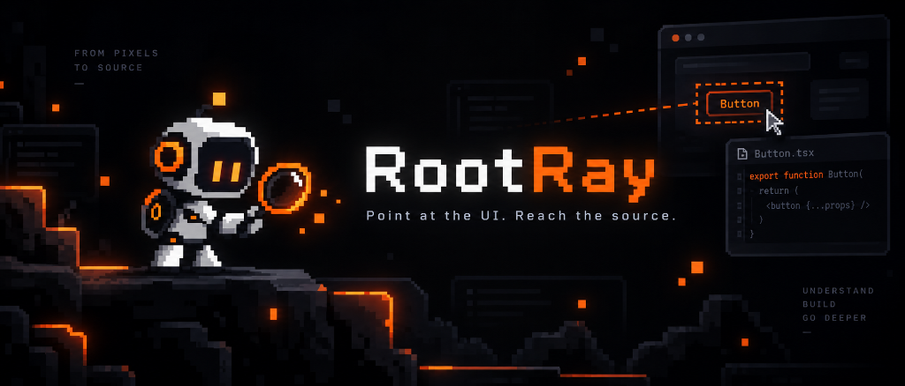
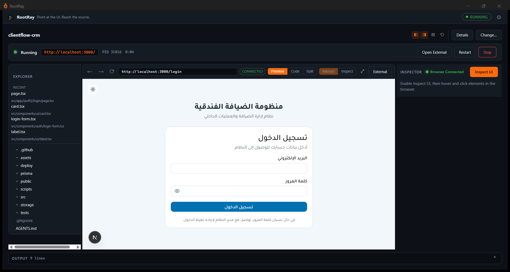
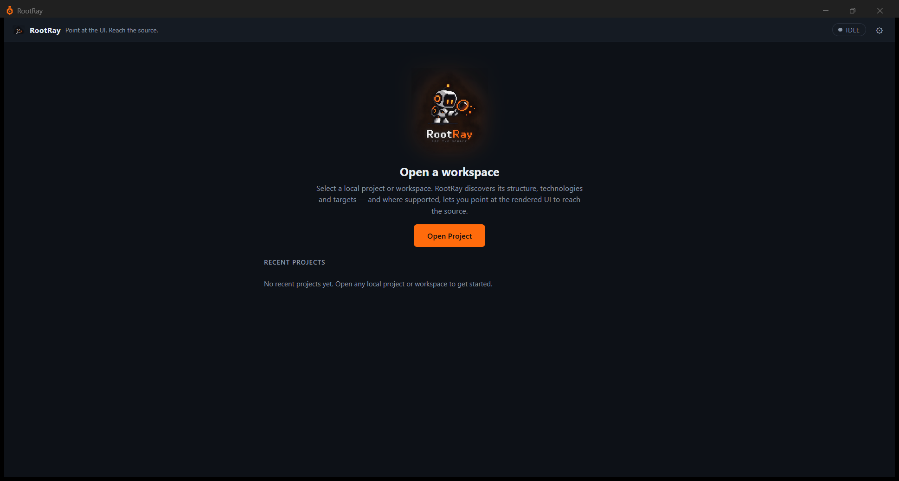
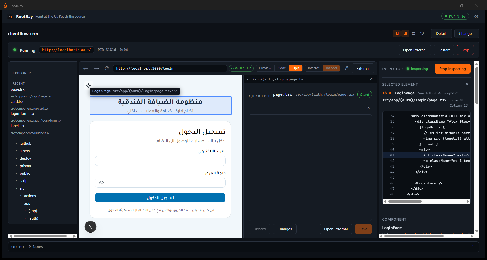
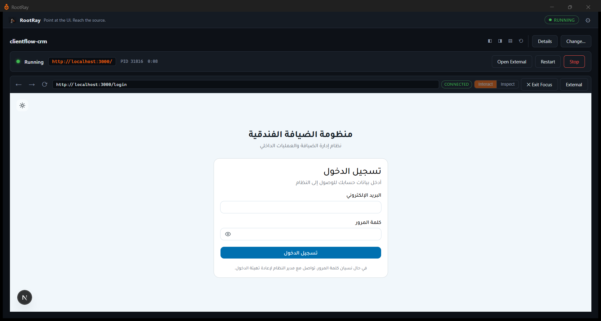

<div align="center">



# RootRay

**Point at the UI. Reach the source.**

RootRay is a local-first Windows developer tool that maps the rendered web
UI back to the source code that produced it — run the project, click what
you see, edit what it opens.

[](https://github.com/3bud-ZC/RootRay/actions/workflows/ci.yml)
[](https://github.com/3bud-ZC/RootRay/releases/latest)
[](LICENSE)
[](#install-windows)
[](https://tauri.app)

[**Download v0.2.0 (latest stable)**](https://github.com/3bud-ZC/RootRay/releases/latest) ·
[**Getting started**](#getting-started) ·
[**Documentation**](docs/architecture.md)

</div>

> **Status:** `main` is **v0.3.0 development** — the Integrated Browser
> Workbench described here. The published stable release is
> **v0.2.0** (universal workspace, external-browser inspection). Download
> buttons always point at the stable release.

## What is RootRay?

RootRay opens your project **inside itself**. Press Run and the dev-server
UI appears in an embedded Preview — not in a separate browser window.
Flip to Inspect, click any element, and the exact source file opens in
the Code pane beside it. Edit, save, and HMR/Fast Refresh updates the
Preview in place. One window: Preview, code, Explorer, Inspector, Output.

```
Open Project → Run → app renders in RootRay's Preview
  → Inspect → click an element
  → source file:line opens beside the Preview
  → component + styles + usages in the Inspector
  → Quick Edit → save → HMR / Fast Refresh → keep going
```

## Why RootRay?

Browser DevTools show you the DOM. Your editor shows you the files.
RootRay closes the gap between them — the rendered element and the exact
`file:line:column` that produced it — without leaving one window.

- **Integrated Browser Workbench** — embedded WebView2 Preview with
  Interact/Inspect modes, browser toolbar (back/forward/reload/URL),
  Preview/Code/Split views plus Preview Focus and Code Focus.
- **Click → source** — authored elements map to their real
  `file:line:column`; runtime-created DOM reports honest facts and
  styles instead of a fabricated location.
- **Flexible layout** — collapsible, resizable Explorer, Inspector and
  Output panes; persisted per machine; Reset Layout when you want it back.
- **Component intelligence** — owning component, definition site and
  resolved callers (React/Next), computed statically, never executed.
- **Safe Quick Edit** — CodeMirror, SHA-256 optimistic concurrency,
  atomic saves, conflict banners instead of clobbering.
- **Universal workspace** — Explorer, Quick Open (`Ctrl+P`), Workspace
  Search (`Ctrl+Shift+F`) on almost any local project.
- **Local-first** — no account, no cloud, no telemetry. Loopback-only
  preview navigation; the Preview webview has zero IPC privileges.

## Screenshots

<p align="center">
  
</p>
<p align="center">
  
  
</p>
<p align="center">
  
</p>

## Install (Windows)

1. Download `RootRay_0.2.0_x64-setup.exe` and its `.sha256` from the
   [latest release](https://github.com/3bud-ZC/RootRay/releases/latest).
2. Verify the checksum (optional but recommended):

   ```powershell
   Get-FileHash .\RootRay_0.2.0_x64-setup.exe
   # compare with the hash inside the .sha256 file
   ```

3. Run the installer — per-user install to `%LOCALAPPDATA%\RootRay`,
   no admin required.
4. Launch **RootRay** from the Start Menu.

**Unsigned build:** releases are not yet code-signed; SmartScreen may
warn on first launch — *More info → Run anyway* if you trust the source.
**WebView2:** required (preinstalled on most Windows 11 and recent
Windows 10); the installer fetches Microsoft's bootstrapper if missing.

## Getting started

1. **Open Project** — pick any local project folder. RootRay runs a
   bounded, read-only discovery (workspace kind, package manager,
   nested targets, per-target capabilities).
2. **Run Project** — launches your dev script through an instrumented
   runner (Vite/Next) or RootRay's loopback static server for
   `index.html` projects. Your `vite.config.*`, `package.json` and
   sources are never modified.
3. **Use the app in the Preview** — it behaves like a browser: navigate,
   click, type. Flip to **Inspect** (`Ctrl+Shift+C`) and click an
   element — the source opens beside the Preview.
4. **Edit and save** — Quick Edit writes through hash-checked atomic
   saves; HMR/Fast Refresh updates the Preview in place.
5. **Arrange the workspace** — collapse Explorer/Inspector/Output
   (`Ctrl+B` / pane buttons / `Ctrl+J`), drag the splitters, or jump
   into Preview Focus / Code Focus.

RootRay never starts a dev server on its own — you press Run.

## Keyboard shortcuts

| Key | Action |
|---|---|
| `Ctrl+Shift+C` | Toggle Inspect mode (works inside the Preview) |
| `Escape` | Leave Inspect mode / close palettes |
| `Ctrl+P` | Quick Open — fuzzy file navigation |
| `Ctrl+Shift+F` | Workspace Search |
| `Ctrl+S` | Quick Edit — save (hash-checked, atomic) |
| `Ctrl+B` | Toggle Explorer pane |
| `Ctrl+J` | Toggle Output pane |

## Supported stacks

Honest capabilities — what each target actually gets:

| Stack | Run | Inspection |
|---|---|---|
| React + Vite | ✓ | Full: click → exact authored source + component intelligence |
| Next.js | ✓ | Full: authored JSX sites, Fast Refresh (Turbopack + webpack dev paths) |
| Vite (non-React), Vue + Vite, Svelte + Vite | ✓ | Generic DOM inspect; authored `index.html` maps exactly |
| Static web (`index.html`) | ✓ built-in server | Generic DOM inspect; authored HTML maps exactly |
| SvelteKit, Astro, Nuxt, Angular, Remotion | ✓ declared script | ○ no adapter yet — the capability rows explain why |
| Node/Express/CLI/library | if a safe script exists | n/a |

Generic-DOM inspection covers every element the page renders — canvas
surfaces included — with facts and styles. What it does **not** do:
Vue/Svelte component mapping, Phaser GameObject mapping, canvas pixel
contents (canvas contents are pixels, not DOM nodes).

**Runtime requirements:** runnable targets need the project's own Node +
package manager on `PATH`. RootRay itself needs neither.

## How source mapping works

At dev-server start, a build-time instrumentation pass stamps
`data-rootray-file/line/column` onto authored JSX (React/Next) or
authored HTML (Vite generic/static). The in-page runtime reads those
attributes when you click and reports them over an authenticated
loopback WebSocket to the desktop — which opens that file beside the
Preview. Elements without stamps are reported as *no authored source* —
RootRay shows what it can prove, never a guess. Details:
[docs/architecture.md](docs/architecture.md).

## Security & privacy

- **Local-first:** no account, cloud backend, telemetry, or AI provider.
  The only listener is a `ws://127.0.0.1` bridge on a dynamic port with
  an ephemeral per-session token.
- **Preview isolation:** the embedded Preview is a separate WebView2
  with **zero IPC privileges** — every privileged command is denied to
  it. Navigation is loopback-only; external links open unprivileged in
  the system browser.
- **Filesystem boundary:** reads/writes are workspace-relative only —
  `..`, absolute paths, symlink escapes, `.env*`, keys, `.git`,
  `node_modules`, oversized/binary files are refused.
- **Process containment:** dev servers run in a Windows Job Object
  (`KILL_ON_JOB_CLOSE`) — no orphaned trees if RootRay dies.
- **Safe writes:** SHA-256 optimistic concurrency + same-directory
  atomic rename; external edits surface as conflicts.

See [SECURITY.md](SECURITY.md) to report a vulnerability.

## Known limitations

- Full source inspection requires React + Vite or a reconstructable
  `next dev` script; other targets get the honest generic-DOM tier.
- Static analysis labels unresolvable imports (aliases, deep barrels,
  `React.lazy`) as *unresolved* — never guessed.
- One Quick Edit session at a time; matched CSS rules link to the
  stylesheet file, not the selector line.
- Unsigned binaries (SmartScreen warning); Windows only.

## Contributing

Contributions welcome — see [CONTRIBUTING.md](CONTRIBUTING.md),
[CODE_OF_CONDUCT.md](CODE_OF_CONDUCT.md) and the
[issue templates](.github/ISSUE_TEMPLATE). Bugs and feature requests:
[GitHub Issues](https://github.com/3bud-ZC/RootRay/issues).
Milestone/release state: [STATUS.md](STATUS.md) ·
[CHANGELOG.md](CHANGELOG.md).

## Development

Prerequisites: Windows 10/11, Rust stable (MSVC) + VS Build Tools (C++
workload), Node.js ≥ 20, pnpm ≥ 9.

```sh
pnpm install
pnpm -r --if-present build   # inspector runtime + plugin bundles
pnpm dev:tauri               # dev build of the desktop app
```

Test and release build:

```sh
pnpm test            # Vitest + Playwright E2E
pnpm test:rust       # cargo test -p rootray-core
pnpm typecheck && pnpm lint
pnpm build:tauri     # → target/release/bundle/nsis/RootRay_*_x64-setup.exe
pwsh -File scripts/installer-smoke.ps1
```

## Roadmap / direction

- **v0.3.0 (in development):** Integrated Browser Workbench — embedded
  Preview, Interact/Inspect, click-to-source in one window, flexible
  panes/focus modes, brand identity.
- **Later:** runtime adapters for SvelteKit/Astro/Nuxt/Angular/Remotion;
  component intelligence beyond React; code signing + auto-update.

## License

MIT — Copyright (c) 2026 Abdallah — ABUD FUN. See [LICENSE](LICENSE).
